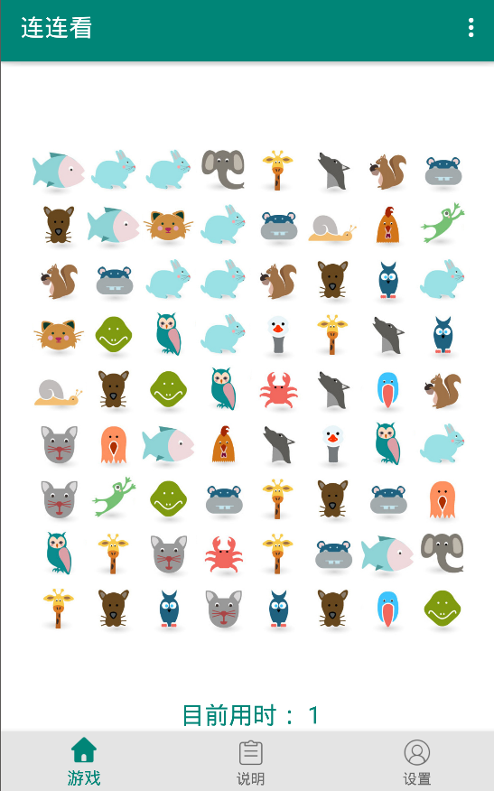
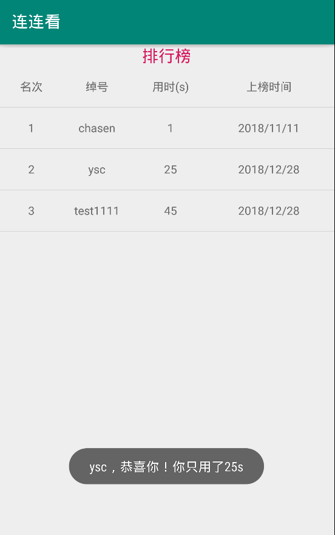

# 连连看
这是一款基于Android studio开发的连连看小游戏。
主要实现的功能有：
- 难度设置
- 打乱重排
- 排行榜
- 背景音乐和消除音效

主要应用的技术：
- fragment
- 事件处理
- 选项菜单
- 自定义view
- Java反射
- handler
- 广播的发送与接收
- 多线程
- preference
- SQLite

本项目几乎涵盖了Android入门级的所有知识点，适合新手练手实践。

